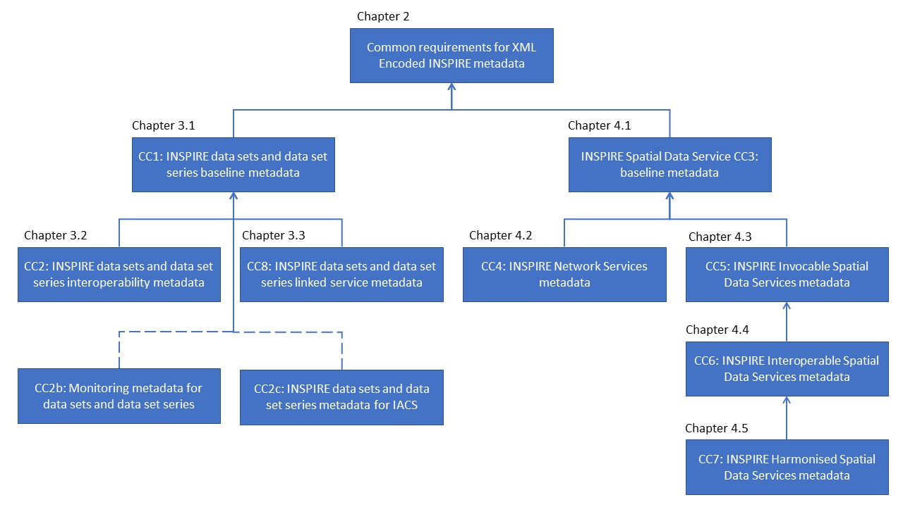

# INSPIRE dataset and service metadata version 2.0 (DRAFT)

The Abstract Test Suites (ATS's) defined in this section are based on the Technical Guidance for the implementation of INSPIRE dataset and service metadata based on ISO/TS 19139:2007 version 2.0 [TG MD](#ref_TG_MD).

## Abstract Test Suites & Conformance Classes

The conformance classes (CC) are compound of requirements that must be passed to be conformant with INSPIRE. An ATS has been created for every CC in order to clarify the process of validation of the requirements.

The [TG MD](#ref_TG_MD) defines 8 CC. The first one is a set of Common Requirements for datasets, data set series and data services. CC1 and CC2 are for datasets and data set series only. Additionaly, a new ATS is included named CC2b with addtional monitoring requirements. Then, from CC3 to CC7 are for data services only.

* Metadata for INSPIRE datasets and data set series
    * [Common Requirements for XML Encoded INSPIRE metadata](./common/README.md)
    * [Conformance Class 1: Baseline metadata for data sets and data set series](./datasets-and-series/README.md)
    * [Conformance Class 2: Interoperability metadata for data sets and data set series](./isdss/README.md)
    * [Conformance Class 2b: Monitoring metadata for data sets and data set series](./monitoring/README.md)

* Metadata for INSPIRE Spatial Data Services
    * [Common Requirements for XML Encoded INSPIRE metadata](./common/README.md)
    * [Conformance Class 3: Baseline metadata for Spatial Data Services](./sds/README.md)
    * [Conformance Class 4: Metadata for INSPIRE Network Services](./ns/README.md)
    * [Conformance Class 5: Metadata for Invocable Spatial Data Services](./sds-invocable/README.md)
    * [Conformance Class 6: Metadata for Interoperable Spatial Data Services](./sds-interoperable/README.md)
    * [Conformance Class 7: Metadata for Harmonised Spatial Data Services](./sds-harmonised/README.md)

## Conformance classes relations and dependencies
The conformance classes in this specification are dependent of each others as shown in the next figure.

Figure 1. Structure of metadata conformance classes. Source: [TG MD](#ref_TG_MD) pag. 27.

The conformance class at one level is dependents of the above levels. For instance, to satisfy conformance class 6 (CC6), the CC5, CC3 and Common requirements must be met too.

Besides, Monitoring metadata requirements (CC2b) depends on CC1 and Common Requirements.

## External document references

| Abbreviation | Document name                       |
| ------------ | ----------------------------------- |
| INSPIRE  | [Directive 2007/2/EC of the European Parliament and of the Council of 14 March 2007 establishing an Infrastructure for Spatial Information in the European Community (INSPIRE)](http://eur-lex.europa.eu/legal-content/EN/TXT/PDF/?uri=CELEX:32007L0002&from=EN)
| IR MD  | [COMMISSION REGULATION (EC) No 1205/2008 of 3 December 2008 implementing Directive 2007/2/EC of the European Parliament and of the Council as regards metadata](http://eur-lex.europa.eu/LexUriServ/LexUriServ.do?uri=OJ:L:2008:326:0012:0030:EN:PDF)
| TG MD  | [Technical Guidance for the implementation of INSPIRE dataset and service metadata based on ISO/TS 19139:2007, version 2.0](https://inspire.ec.europa.eu/sites/default/files/documents/metadata/inspire-tg-metadata-iso19139-2.0.1.pdf)
| REG  | [INSPIRE Registry](http://inspire.ec.europa.eu/registry/)
| ISO 19115  | [ISO 19115:2003 Geographic information - Metadata](http://www.iso.org/iso/catalogue_detail.htm?csnumber=26020)
| ISO 19119  | [ISO 19119:2005 Geographic information - Services](http://www.iso.org/iso/catalogue_detail.htm?csnumber=39890)
| ISO 19108  | [ISO 19108:2002 Geographic information -- Temporal schema](http://www.iso.org/iso/catalogue_detail.htm?csnumber=26013)
| ISO 8601  | [ISO 8601:2004 Data elements and interchange formats -- Information interchange -- Representation of dates and times](http://www.iso.org/iso/catalogue_detail?csnumber=40874)
| ISO 639-2/B   | [ISO 639-2/B: Codes for the Representation of Names of Languages](http://www.loc.gov/standards/iso639-2/)
